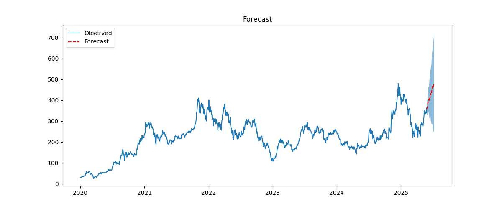

# Stock Forecast Dashboard

A containerized FastAPI application for fetching Tesla (TSLA) stock data, fitting a seasonal ARIMA model, forecasting future prices, simulating future paths, and displaying results on a simple web interface.

---

## Features

* **Data Retrieval**: Downloads historical TSLA price data via `yfinance`.
* **Time Series Modeling**: Fits a seasonal ARIMA model (`auto_arima`) and performs stationarity checks.
* **Forecast & Simulation**:

  * Generates a point forecast with confidence intervals.
  * Simulates multiple future price paths.
* **Web Interface**: Serves a dashboard with a “Run Prediction” button, displaying:

  * Summary statistics
  * Forecast plot
  * Simulation plot
  * (Optional) Residual diagnostics toggle
* **Dockerized** for easy deployment on any Linux server.

---

## Project Structure

```
Server_tsla-prediction/
├── app.py                 # FastAPI application
├── Dockerfile             # Docker image definition
├── docker-compose.yml     # (Optional) for multi-service setups
├── requirements.txt       # Python dependencies
├── outputs/               # Generated plots & summaries
├── mytslaapp/             # Core data/model/report package
│   ├── __init__.py
│   ├── data.py
│   ├── model.py
│   └── report.py
├── templates/             # Jinja2 HTML templates
│   └── index.html
└── README.md              # This file
```

---

## Prerequisites

* Docker & Docker Compose (optional but recommended)
* If developing locally without Docker:

  * Python 3.11 (pmdarima wheels currently support up to 3.11)
  * [`pipenv`](https://pipenv.pypa.io/) or `venv` + `pip`

---

## Installation

### Using Docker (Recommended)

```bash
# Build the Docker image (run from project root)
docker build -t tsla-forecast .

# Run the container, mapping port 8000 and outputs folder
docker run -d \
  --name tsla_forecast \
  -p 8000:8000 \
  -v "$PWD/outputs":/app/outputs \
  --restart unless-stopped \
  tsla-forecast
```

### Running Locally (No Docker)

```bash
# Create & activate a Python 3.11 venv
python3.11 -m venv .venv
source .venv/bin/activate

# Install dependencies
pip install --upgrade pip
pip install -r requirements.txt

# Launch the server
uvicorn app:app --host 0.0.0.0 --port 8000
```

---

## Usage

1. Open your browser to `http://<server-ip>:8000/`.
2. Click **Run Prediction**.
3. View summary metrics and plots on the page.
4. (Optional) Click **Show/Hide Residual Diagnostics** at the bottom to inspect model residuals.

---

## API Endpoint

* **GET** `/predict` — Runs the pipeline and returns JSON:

  ```json
  {
    "summary": { ... },
    "images": {
      "forecast": "/outputs/forecast.png",
      "simulations": "/outputs/simulations.png",
      "residuals": "/outputs/residuals.png"
    }
  }
  ```

---

## Outputs and Sample Images

All generated plots and summary files are saved to the `outputs/` directory by default. Examples are as per below:




---
## Summary Statistics

```bash
Proportion ending above model end price: 0.85
Proportion ending below model end price: 0.15
Ratio up/down relative to model end price: 5.71
Mean simulated final price $: 490.61
Median simulated final price $: 487.67
Lower Quartile (25th percentile) $: 405.67
Upper Quartile (75th percentile) $: 574.66
```
---
---

## Contributing

1. Fork the repo
2. Create a feature branch: `git checkout -b feature/YourFeature`
3. Commit your changes
4. Push to your branch and open a Pull Request

---

## License

This project is licensed under the MIT License. See [LICENSE](LICENSE) for details.
